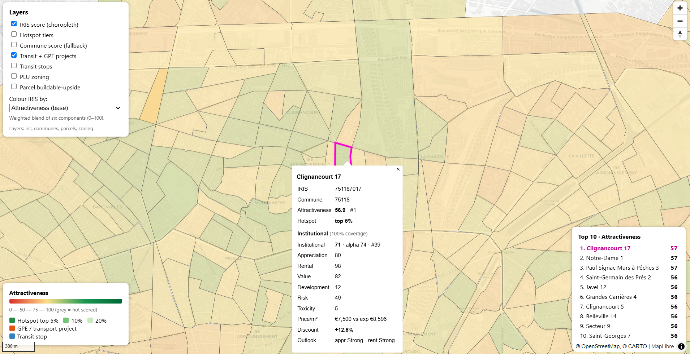
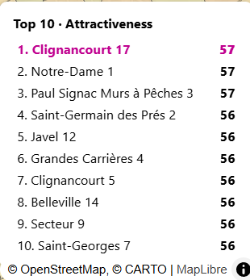
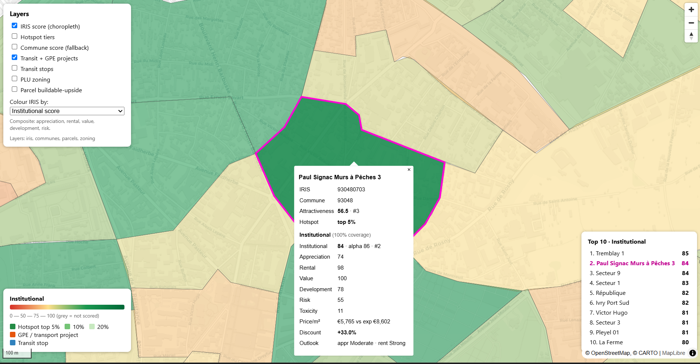
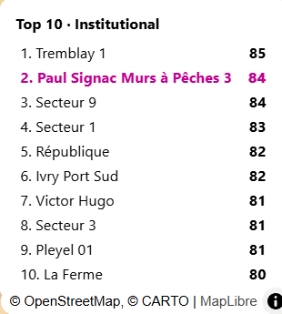

# Real-estate intelligence

French residential analytics, from raw open data to an interactive investment map at the IRIS (neighbourhood) level.

The pipeline ingests free public data, scores communes, IRIS units, and parcels from 0 to 100, detects zoning, transport, and price signals, and serves the result on a live MapLibre map.

## What it does

Scoring runs at the IRIS level, about 1,300 neighbourhoods across the Grand Paris watchlist, not just whole communes. Each area gets separate Appreciation, Rental, Value (€/m² discount), Development, Risk, and Toxicity scores. These blend into a composite Institutional score and an Acquisition Alpha signal that looks for underpriced areas with future catalysts.

Factors with no data feed are weighted out and renormalised rather than faked, and every IRIS reports how much of its score is data-backed. The whole pipeline runs on local Parquet/GeoParquet (`REI_STORAGE=files`) with no database, or scales to PostgreSQL + PostGIS in production. Every feed is a free public source: INSEE Melodi, DVF, Cadastre, BAN, Sit@del (SDES/DiDo), GTFS, GPU/PLU zoning, and geo.api.gouv.fr. On the map you can colour by any score, read a live top-10 leaderboard per metric, click an area to highlight it, and open a per-IRIS detail panel.

## Contents

[Quickstart](#quickstart-no-database) · [Scoring model](#scoring-model) · [Price forecast](#price-forecast) · [The map](#the-map) · [Screenshots](#screenshots) · [Architecture](#architecture) · [Data sources](#data-sources) · [Production (Docker + PostGIS)](#production-docker--postgis) · [Tests and development](#tests-and-development) · [Roadmap](#roadmap)

## Quickstart (no database)

```bash
pip install -r requirements.txt && pip install -e .
python main.py
```

One command ingests the Grand Paris watchlist into `./data/`, scores IRIS units from 0 to 100 (commune scores are kept as a fallback), exports GeoJSON, and opens the map at http://localhost:8000.

```bash
python main.py --score-level iris        # default: IRIS primary + commune fallback
python main.py --score-level commune     # commune-only (faster, no IRIS layer)
python main.py --communes 75056,93066,93070
python main.py --with-parcels            # add cadastre + zoning + parcel upside
python main.py --with-transit            # also download GTFS (large)
python main.py --skip-ingest             # reuse files already in ./data
python main.py --no-serve                # build files, don't open the server
```

`./data/`, `./webmap/`, `*.parquet`, and `*.geojson` are git-ignored. `main.py` regenerates them, so the repo stays code-only.

## Scoring model

Two layers run on the same pipeline.

Base attractiveness (`score_total`, 0–100) is a weighted blend of six components (demographics, economics, housing market, supply, accessibility, development) with a risk overlay.

Institutional scores (`rei/scoring/institutional.py`) answer a narrower question: where should I buy today to maximise appreciation and rental performance over 5 to 15 years?

| Score | Answers | Data status (Phase 1) |
|-------|---------|-----------------------|
| Value (€/m² discount) | Am I buying below fair value? Hedonic expected vs observed €/m² | data-backed (DVF) |
| Development | Can I create value? Underbuilt land (footprint coverage)* | data-backed (cadastre + buildings) |
| Appreciation | Will it be worth more later? Price momentum + supply constraint | partial |
| Risk | What can go wrong? Price volatility + liquidity (higher = safer) | partial |
| Rental | Can I rent easily and raise rents? Liquidity (+ density) | stub-heavy |
| Toxicity | What to avoid? Falling price + weak liquidity (0 = good, 100 = avoid) | partial |

```
Institutional = 0.30·Appreciation + 0.25·Rental + 0.20·Value + 0.15·Development + 0.10·Risk
Alpha         = 0.35·Appreciation + 0.25·Value + 0.20·Transit + 0.10·Development + 0.10·Rental
```

Weights are renormalised over the components that have data on a given run, so missing feeds never inflate a score. The per-IRIS `data_coverage` field reports how much of the weight was real.

*Development uses building footprint coverage (emprise au sol). True FAR needs building heights, which the current buildings layer doesn't carry. See [Roadmap](#roadmap).

## Price forecast

A separate model estimates each commune's expected forward price growth (annualised €/m² CAGR) from its own transaction history. It is gradient-boosted (LightGBM, with a scikit-learn fallback) and trained on point-in-time features, so a training row never sees data from its own forward window. It also returns a p10–p90 band (quantile regression) and the main factors behind each prediction (SHAP, in plain language); `rei/ml/backtest.py` checks it out of time with a walk-forward backtest. Results are written to `scores.ml_forecast` (database) or `data/tables/ml_forecast.csv` (file mode), with `expected_price_cagr`, `cagr_p10`, `cagr_p90`, `horizon`, and `top_drivers`.

```bash
# First run: fetch several DVF years, then train and save the model
python main.py --score-level iris --with-forecast --dvf-years 2020,2021,2022,2023,2024,2025

# Later runs reuse cached data and the saved model (fast)
python main.py --score-level iris --with-forecast

python main.py --with-forecast --refresh     # re-fetch sources even if data exists
python main.py --with-forecast --retrain     # refit even if a saved model exists
```

Both stages are cached. Ingestion is skipped when the data is already in `./data` (unless `--refresh` or `--dvf-years` is passed), and the saved model in `data/models/price_growth.joblib` is reused unless it is missing, `--retrain` is set, or new data was just fetched. `--forecast-horizon` is the maximum lookahead; the pipeline lowers it to fit the available history.

Run it standalone with the CLI (add `--storage files` outside Docker):

```bash
python -m rei.cli train --storage files
python -m rei.cli predict --storage files
python -m rei.cli backtest --storage files
```

On the map, click any IRIS or commune to read its forecast in the detail popup: expected growth with a verdict, the likely range, and the main factors. The Streamlit "Price forecast" tab ranks communes by expected growth in database mode.

The forecast is commune-level, so every IRIS in a commune shows that commune's figure, and it needs several years of DVF to be useful. With only one or two years the model cannot separate communes and the values read near-uniform, so pull more history with `--dvf-years`.

## The map

Served from `./webmap/` (source: `dashboards/map/index_files.html`).

You can switch the choropleth between Attractiveness, Institutional, Alpha, Value, Appreciation, Development, and Risk; the legend and explainer update with a plain-language description of the selected metric. A top-10 leaderboard in the bottom-right lists the best IRIS for whatever metric you pick, and clicking a row zooms to that neighbourhood and draws a magenta highlight outline around it. Clicking any zone opens a detail panel with its full breakdown: every sub-score, observed vs expected €/m², discount %, outlook, and how much of the score is data-backed. Layers include the IRIS choropleth, hotspot tiers, commune fallback, PLU zoning, transit and GPE projects, and parcel buildable-upside.

## Screenshots

Drop your PNGs into `docs/screenshots/` using the filenames below and they'll render here.

| IRIS attractiveness choropleth | Colour-by metric + top-10 leaderboard |
|:--:|:--:|
|  |  |
| IRIS detail panel (institutional breakdown) | Selected-zone highlight |
|  |  |

<!-- Tip: 1600px-wide PNGs look best. Captions above can be edited freely. -->

## Architecture

| Layer | Role | Code |
|-------|------|------|
| Ingestion | Collectors with retry + rate limits, source registry | `rei/ingestion/`, `config/sources.yaml` |
| Warehouse | PostgreSQL + PostGIS + pgvector (or Parquet in file mode) | `database/`, `rei/etl/`, `rei/common/store.py` |
| GIS | Density, accessibility, parcels | `rei/gis/` |
| Intelligence | PLU diff, density signals, transport impact | `rei/zoning/`, `rei/transport/` |
| Scoring | Commune + IRIS 0–100, institutional suite, ML forecast | `rei/scoring/` (`files_engine`, `iris_engine`, `institutional`), `rei/ml/` |
| Export / API | GeoJSON export (file mode), vector tiles (DB mode) | `rei/api/export.py`, `rei/api/tiles.py` |
| UI | MapLibre map + Streamlit dashboard | `dashboards/` |
| Orchestration | Scheduled ingestion + scoring | `airflow/dags/` |

The same collector code serves both backends; `rei/common/store.py` dispatches to Parquet or PostGIS based on `REI_STORAGE`.

## Data sources

Registry: `config/sources.yaml`. Architecture notes: `docs/`.

Core feeds are INSEE Melodi (population, FiLoSoFi income), DVF (transactions), Cadastre (parcels + buildings), BAN, Sit@del / SDES DiDo (building permits), GTFS (transit), GPU (PLU zoning), geo.api.gouv.fr (commune contours), and OpenDataSoft georef-france-iris (IRIS contours). All are keyless and free, and ingestion is polite: token-bucket rate limiting plus exponential backoff.

## Production (Docker + PostGIS)

```bash
cp .env.example .env
docker compose -f docker/docker-compose.yml --env-file .env up -d --build

docker compose -f docker/docker-compose.yml run --rm app \
  python -m rei.cli ingest dvf_transactions --communes 93066,93070,94076
docker compose -f docker/docker-compose.yml run --rm app python -m rei.cli refresh-views
docker compose -f docker/docker-compose.yml run --rm app \
  python -m rei.cli score --profile value_add_opportunistic
```

UIs: Streamlit on `:8501`, map on `:8000`, Airflow on `:8080`. Vector tiles: `GET /tiles/{layer}/{z}/{x}/{y}.pbf`.

Postgres role and database (match `.env`):

```sql
CREATE ROLE rei LOGIN PASSWORD 'change_me';
CREATE DATABASE rei OWNER rei;
\c rei
CREATE EXTENSION IF NOT EXISTS postgis;
CREATE EXTENSION IF NOT EXISTS vector;
```

## Tests and development

```bash
python -m venv .venv && .venv\Scripts\activate
pip install -r requirements.txt && pip install -e .
pytest -q          # scoring, DVF cleaning, validation, tile SQL; no DB required
```

Airflow installs separately (`requirements-airflow.txt`). The LLM document agent (`rei/ai_agent/`) is optional and manual by default; see `python -m rei.ai_agent.run --help`.

Project layout:

```
config/          settings, sources.yaml
rei/             ingestion, etl, gis, zoning, transport, scoring, ml, ai_agent, api
  scoring/       files_engine · iris_engine · institutional · indicators
database/        DDL, matviews, indexes
airflow/dags/    schedules
docker/          compose stack
dashboards/map/  MapLibre map (index_files.html)
docs/            strategy notes · screenshots
tests/
```

## Roadmap

Phase 1 (data-backed scores from existing feeds) is in place. Phase 2 wires the missing inputs into score slots that already exist, with no redesign needed.

| Area | Next feed |
|------|-----------|
| Growth | Multi-year INSEE population and income for a real CAGR in Appreciation |
| Rental | Employment density (SIRENE / INSEE RP), vacancy, renter share, student demand |
| Accessibility | Transit + GPE per-IRIS distances (GTFS / IDFM) |
| Development | Building heights for true FAR / underbuilt potential |
| Supply | Sit@del permits pipeline (DiDo) into the supply signal |

See `IRIS_AUDIT.md` for the IRIS architecture audit and root-cause notes.
